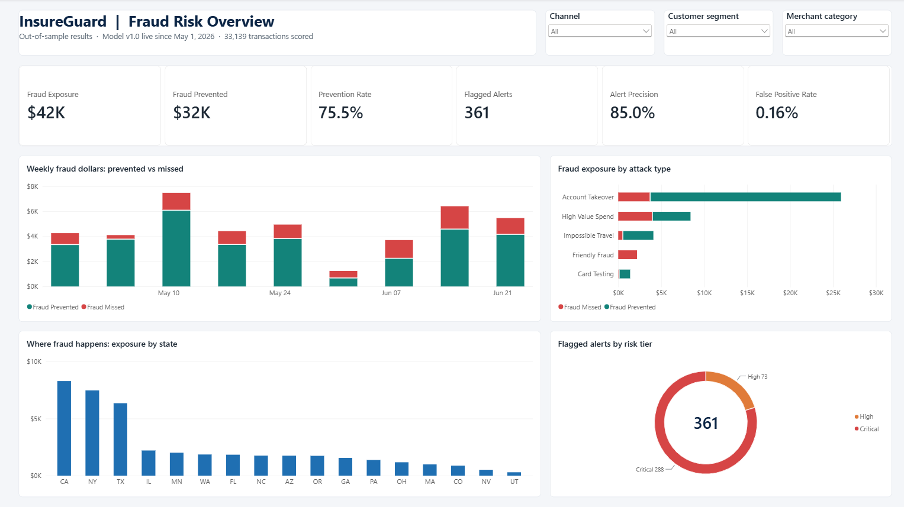
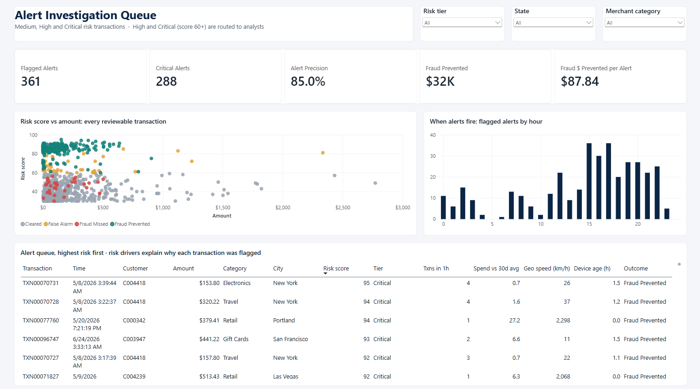
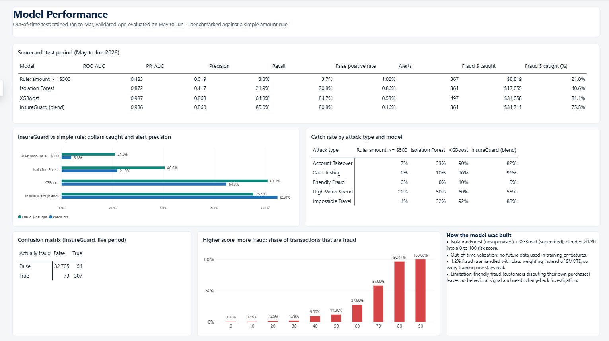

# InsureGuard

**End-to-end financial fraud and anomaly detection pipeline:** synthetic transaction data, PostgreSQL feature engineering, machine learning risk scoring, and an executive fraud exposure dashboard.

> Status: Step 4 of 5 complete (data, SQL features, ML risk scoring, Power BI dashboard). Built in public, step by step.



## Results at a glance

On two months of transactions the models never saw during training (May to June 2026):

| | Simple rule (amount >= $500) | **InsureGuard** |
|---|---:|---:|
| Fraud transactions caught (recall) | 3.7% | **80.8%** |
| Alerts that are real fraud (precision) | 3.8% | **85.0%** |
| Fraud dollars caught | 21.0% | **75.5%** |
| Legitimate customers wrongly flagged | 1.08% | **0.16%** |

With a similar alert volume (about 1.1% of transactions), InsureGuard catches **3.6x more fraud dollars** than a dollar-amount rule while flagging **7x fewer** legitimate customers.

## Pipeline

```
generate_data.py  ->  PostgreSQL (star schema)  ->  SQL feature engineering  ->  ML risk scoring  ->  Power BI dashboard
     Step 1              Step 1                        Step 2                       Step 3              Step 4
```

## Step 1: Data and schema

Public fraud datasets either anonymize away the fields fraud analysts actually use (Kaggle's credit card set is PCA components only) or lack a reliable customer key. InsureGuard instead simulates **100,000 transactions across 5,000 customers and 8,446 devices** over six months.

A first version of the data was *too* easy: a model scored a perfect 1.0 ROC-AUC because legitimate customers never traveled or changed phones. The generator now deliberately includes **innocent anomalies** that make real fraud detection hard:

- multi-day trips to distant cities (legitimate cross-country jumps)
- new phones activated mid-period (legitimate brand-new devices)
- bursts of small purchases (coffee, transit, app stores)
- night-owl customers who routinely shop after midnight

Fraud (**1.2% of rows, $125K**) is injected as incidents with overlapping, imperfect signatures:

| Scenario | Signature | Rows | Avg amount |
|---|---|---:|---:|
| Card testing | 3 to 10 small charges within 90 minutes, usually a new device | 569 | $7.85 |
| Account takeover | 2 to 6 high-value online purchases, usually a new device, often a distant city | 360 | $190.07 |
| Friendly fraud | Customer disputes their own ordinary purchase | 118 | $76.85 |
| High-value spend | 4 to 20x normal spend on the customer's own device, often at night | 84 | $397.84 |
| Impossible travel | Purchase far from a home purchase made shortly before | 69 | $136.54 |

The median fraudulent transaction ($29.51) is *smaller* than the median legitimate one ($38.34). Amount thresholds alone miss most fraud, which is why the pipeline relies on behavioral features.

### Schema

| Table | Grain | Key columns |
|---|---|---|
| `insureguard.dim_customer` | one row per account holder | `customer_id`, home location, segment, signup date |
| `insureguard.dim_device` | one row per device fingerprint | `device_id`, `customer_id`, device type, first seen |
| `insureguard.fact_transaction` | one row per transaction | `transaction_id`, `customer_id`, `device_id`, `txn_timestamp`, `amount`, category, channel, lat/lon, `is_fraud` |

DDL is PostgreSQL and Snowflake compatible. A composite index on `(customer_id, txn_timestamp)` supports the window functions used for feature engineering.

## Step 2: SQL feature engineering

[`sql/02_features.sql`](sql/02_features.sql) builds `insureguard.txn_features` (100,000 rows in about 2.5 seconds) using PostgreSQL window functions with time-based `RANGE` frames. Every feature uses only the customer's history up to that transaction, so nothing from the future leaks into the model.

| Family | Features | Technique |
|---|---|---|
| Rolling spend | `avg_amount_7d`, `avg_amount_30d`, `amount_to_avg_7d_ratio`, `amount_to_avg_30d_ratio` | `RANGE BETWEEN INTERVAL '30 days' PRECEDING`, current row excluded from the baseline |
| Velocity | `txn_count_1h`, `txn_count_24h`, `amount_sum_1h`, `amount_sum_24h` | sliding time windows per customer |
| Geographic jump | `km_from_prev_txn`, `minutes_since_prev_txn`, `geo_velocity_kmh`, `km_from_home` | `LAG()` + haversine distance in SQL |
| Device and context | `device_age_hours`, `hour_of_day`, `day_of_week`, `is_night`, `is_online` | first-seen device timestamp per account |

Medians per scenario from [`sql/03_feature_validation.sql`](sql/03_feature_validation.sql):

| Scenario | Spend vs 30d avg | Txns in 1h | Geo velocity (km/h) | Device age (hours) | Night share |
|---|---:|---:|---:|---:|---:|
| Legitimate | 0.74x | 1 | 0.1 | 1,751 | 4% |
| Card testing | 0.32x | **4** | 74.1 | **0.26** | 2% |
| Account takeover | 1.45x | 2 | 12.0 | **1.00** | 7% |
| Friendly fraud | 1.30x | 1 | 0.0 | 1,473 | 0% |
| High-value spend | **3.57x** | 1 | 1.0 | 1,580 | **52%** |
| Impossible travel | 2.30x | 1 | **994.5** | **0.00** | 6% |

## Step 3: Machine learning risk scoring

[`src/train_model.py`](src/train_model.py) trains two complementary models and blends them into one **Anomaly Risk Score (0 to 100)** per transaction.

| Model | Type | Role |
|---|---|---|
| Isolation Forest | Unsupervised (no labels) | Flags anything unusual, including fraud patterns never seen before |
| XGBoost | Supervised | Learns known fraud patterns from labeled history |
| **Risk score** | 80% XGBoost + 20% Isolation Forest | Tiers: Low (<30), Medium (30 to 59), High (60 to 79), Critical (80+); High and above are flagged for review |

**Design choices**
- **Out-of-time validation:** train on January to March, early-stop on April, report on May to June only. A random split would let the model peek at future behavior.
- **Class imbalance (1.2% fraud):** handled with XGBoost `scale_pos_weight` rather than SMOTE. SMOTE interpolates between fraud rows and invents velocity and location combinations that cannot physically exist; weighting keeps every training row real.
- **Baseline comparison:** every model is benchmarked against a simple amount rule and at a comparable alert volume.

**Test-period results (33,139 transactions, $42K fraud)**

| Model | ROC-AUC | PR-AUC | Precision | Recall | Fraud $ caught |
|---|---:|---:|---:|---:|---:|
| Rule: amount >= $500 | 0.483 | 0.019 | 3.8% | 3.7% | 21.0% |
| Isolation Forest only | 0.872 | 0.117 | 21.9% | 20.8% | 40.6% |
| XGBoost only | 0.987 | 0.868 | 64.8% | 84.7% | 81.1% |
| **InsureGuard blend** | **0.986** | **0.860** | **85.0%** | **80.8%** | **75.5%** |

Recall by scenario: card testing 96%, impossible travel 88%, account takeover 82%, high-value spend 55%, friendly fraud 0%. Friendly fraud is the honest limitation: a customer disputing their own normal purchase leaves no behavioral trace, which is why real issuers handle it through chargeback investigation rather than transaction models.

Scores are written to `insureguard.txn_risk_scores` for the dashboard, and full metrics to [`reports/model_metrics.json`](reports/model_metrics.json).

## Step 4: Power BI dashboard

A three-page report on a star-schema semantic model (`fact_transactions` with customer and date dimensions) built from the reporting views in [`sql/04_bi_views.sql`](sql/04_bi_views.sql), with 20 DAX measures ([`dashboard/measures.dax`](dashboard/measures.dax)). The report is saved as a **Power BI Project (PBIP/PBIR)**, so every page, visual and measure is a readable text file under version control in [`dashboard/`](dashboard).

Executive pages are filtered to the out-of-sample live period so the headline numbers reflect real model performance, not training fit.

| Page | Audience | Highlights |
|---|---|---|
| **Executive Overview** | Leadership | Fraud exposure, dollars prevented, prevention rate, alert precision, weekly prevented vs missed trend, exposure by attack type and state |
| **Alert Investigation** | Fraud analysts | Alert queue sorted by risk score with the behavioral drivers behind each flag (velocity, spend ratio, geo speed, device age), risk vs amount scatter, alerts by hour |
| **Model Performance** | Data science / audit | Scorecard vs the amount rule, catch rate by attack type, confusion matrix, fraud rate by score band |





The fraud-rate-by-score chart is the clearest proof the score is meaningful: **0.03%** of transactions scoring 0 to 9 are fraud, versus **96%+** of those scoring 80 or higher.

## Quick start

```bash
pip install -r requirements.txt
cp .env.example .env            # then set your PostgreSQL password
python src/generate_data.py     # Step 1: writes data/raw/*.csv
python src/load_to_postgres.py  # Step 1: schema + bulk load
python src/build_features.py    # Step 2: feature table + validation report
python src/train_model.py       # Step 3: train, evaluate, write risk scores
python src/build_bi.py          # Step 4: reporting views for Power BI
```

Then open `dashboard/InsureGuard.pbip` in Power BI Desktop and refresh.

## Project structure

```
InsureGuard/
├── dashboard/
│   ├── InsureGuard.pbip           Power BI project (open in Power BI Desktop)
│   ├── InsureGuard.Report/        pages and visuals as JSON (PBIR)
│   ├── InsureGuard.SemanticModel/ tables, relationships, measures as TMDL
│   ├── measures.dax               DAX measures, documented
│   ├── insureguard_theme.json     report color theme
│   └── DASHBOARD_SPEC.md          page-by-page dashboard specification
├── docs/                          dashboard screenshots
├── reports/
│   └── model_metrics.json         test-period metrics + feature importance
├── sql/
│   ├── 01_schema.sql              star schema DDL
│   ├── 02_features.sql            window-function feature engineering
│   ├── 03_feature_validation.sql  per-scenario feature medians
│   └── 04_bi_views.sql            reporting layer for Power BI
└── src/
    ├── db.py                      shared connection helpers
    ├── generate_data.py           synthetic data generator
    ├── load_to_postgres.py        COPY-based bulk loader
    ├── build_features.py          runs feature SQL + prints validation
    ├── train_model.py             Isolation Forest + XGBoost risk scoring
    └── build_bi.py                builds the bi schema for the dashboard
```

## Tech stack

Python (pandas, NumPy, scikit-learn, XGBoost), PostgreSQL 18, SQL window functions, Power BI (DAX, star schema, PBIP), Git
